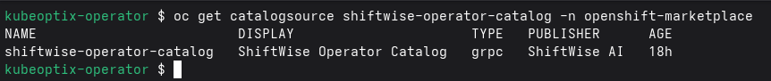
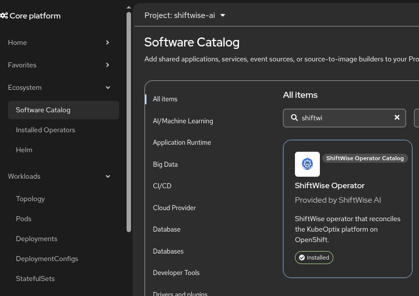
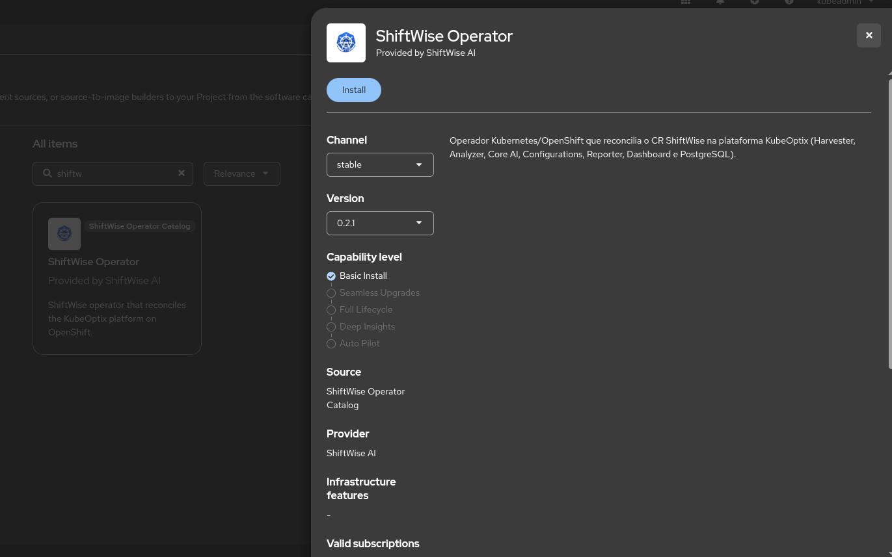
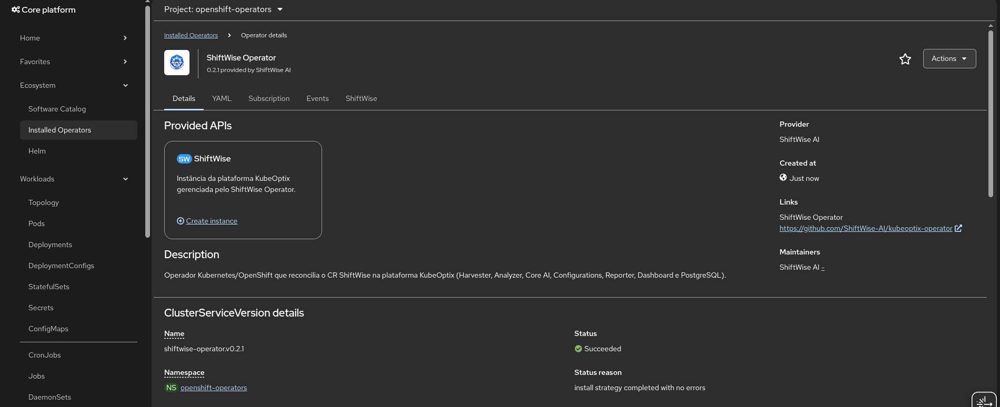
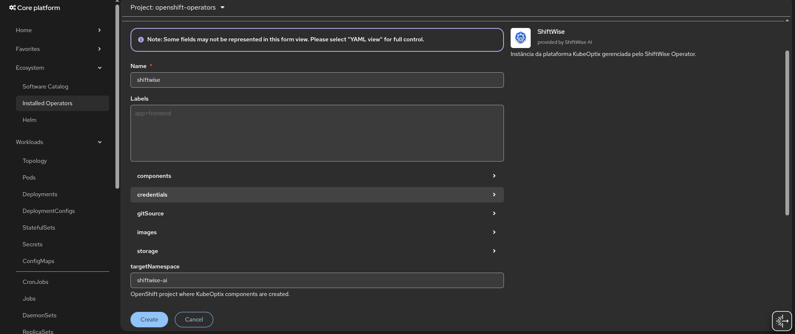
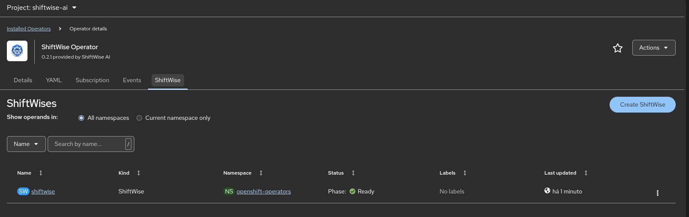
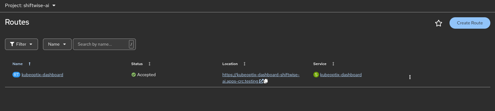

# ShiftWise Operator

Operador OpenShift da plataforma **KubeOptix**. Instale pelo OperatorHub, crie um `ShiftWise` e o Dashboard fica disponível numa Route.

Componentes (Harvester, Analyzer, Core AI, Configurations, Reporter, Dashboard e PostgreSQL) sobem no projeto `shiftwise-ai`. Só o Dashboard tem rota pública. Imagens vêm do Quay; as credenciais do banco são geradas automaticamente.

---

## 1. Catalogo no cluster

Com `oc` autenticado como administrador:

```bash
oc apply -f config/olm/catalogsource.yaml
```

Aguarde o catalogo ficar **READY**:

```bash
oc get catalogsource shiftwise-operator-catalog -n openshift-marketplace
```

**Print 1 — CatalogSource READY no OpenShift**



---

## 2. Instalar pelo OperatorHub

1. Na consola, abra **Operators → OperatorHub**.
2. No filtro de fontes, marque **ShiftWise Operator Catalog**.
3. Busque **ShiftWise Operator** e abra o tile.
4. Clique em **Install** e confirme. O namespace sugerido é `shiftwise-ai`.

**Print 2 — OperatorHub, busca do ShiftWise Operator**



**Print 3 — Tela de instalação do operator**



---

## 3. Achar o operator instalado

**Operators → Installed Operators**. No seletor de projeto, use `shiftwise-ai` ou **All Projects** e abra **ShiftWise Operator**.

**Print 4 — Installed Operators**



---

## 4. Criar uma instância ShiftWise

Na página do operator, confirme que o projeto é **`shiftwise-ai`**. Depois: aba **ShiftWise → Create ShiftWise**.

O único campo que importa é **storage** (tamanho do volume compartilhado). O resto o operator preenche.

**Print 5 — Formulário Create ShiftWise**



Aguarde a instância ficar **Ready**.

**Print 6 — Instância Ready**



Pela CLI:

```bash
oc apply -f config/samples/shiftwise.ai_v1alpha1_shiftwise.yaml
oc get shiftwises -A
```

---

## 5. Abrir o Dashboard

**Networking → Routes**, projeto `shiftwise-ai`. A rota é `kubeoptix-dashboard`.

**Print 7 — Route do Dashboard**



```bash
oc get route kubeoptix-dashboard -n shiftwise-ai
```

---

Os prints acima devem ficar em `docs/images/` com os nomes indicados em cada seção.
